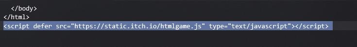

# GameMaker Games

This is a guide on how to make a single-file web game from a web-exported GameMaker game. Here are the things you will need:

* A GitHub account
* A text editor
* A GameMaker game that has been built for web
* GitHub Desktop
* [Network Zipper](https://chromewebstore.google.com/detail/network-zipper/deifknnbjkpchacoigdmcleejjjcidao)

In this tutorial, I will be doing **shrubnaut**. To find a game, I recommend going on [itch.io](https://itch.io). You will need to go onto the itch.io page of the game you are doing and open developer tools while the game is running. Go into the elements tab and search for `"html-classic"`. Copy the link that looks like this:
`https://html-classic.itch.zone/html/14864535/index.html`

Once you have your `html-classic` URL, open it in another tab. Then open Network Zipper and click **refresh files**. Once it has all the files and the game is done loading, click **download**.

Next, open the downloaded zip file and find the folder that has the HTML file. Rename it to the name of your game and copy it into your GitHub Desktop repository. Make a copy of the HTML file and name it something else. After doing that, commit and push to your GitHub repo.

Go to your repo on [github.com](https://github.com) and find the HTML file. Copy the URL. Next, go to [jsdelivr](https://www.jsdelivr.com/github) and convert the GitHub link into a jsdelivr link. Remove the last part of your jsdelivr link that has the name of the HTML file. It should look something like this:
`https://cdn.jsdelivr.net/gh/Stinkalistic/UGS@main/MISC/shrubnaut/`

Next, open your other HTML file in a text editor. At the top, after where it says `<head>`, add this line:

```html
<base href="REPLACE">
```

Replace the part that's in quotations with your jsdelivr URL. After that, it should look like this

```html
<base href="https://cdn.jsdelivr.net/gh/Stinkalistic/UGS@main/MISC/shrubnaut/">
```

Also, if it has this line at the bottom, make sure to remove it



After doing this, save your HTML file and run it. If you did everything correctly, it should work.
